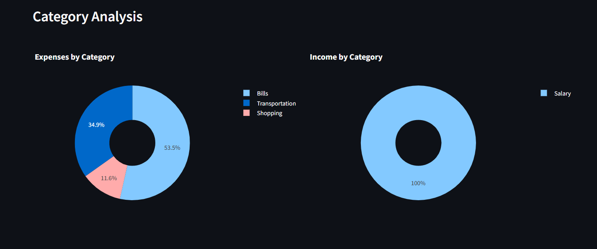
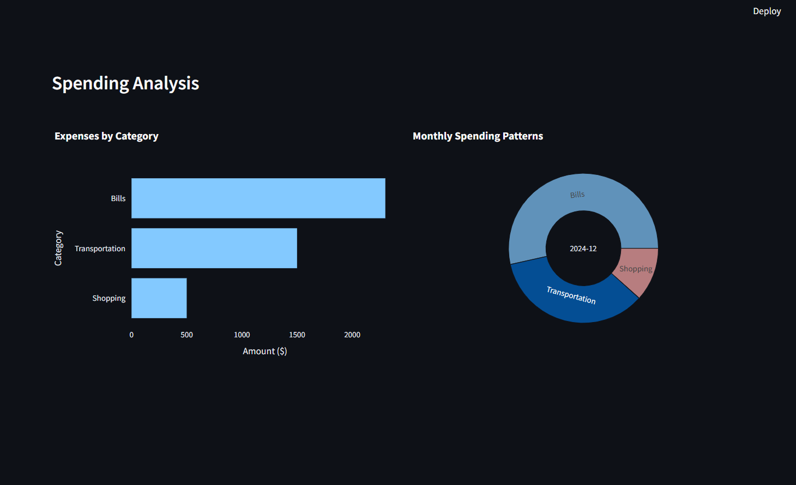
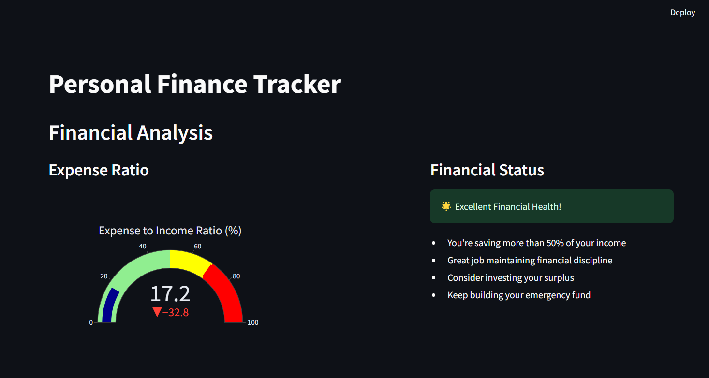

# Personal Finance Tracker

A full-stack web application for tracking personal finances with real-time analytics and financial health monitoring.

## 🌟 Features

### Core Features
- User authentication with secure JWT
- Income and expense tracking
- Interactive dashboard with real-time updates


- Detailed financial analysis and insights
- Transaction categorization and filtering


- Monthly and daily transaction visualization


### Financial Analysis
- Expense ratio monitoring with health indicators
- Category-wise spending analysis
- Monthly income vs expenses tracking
- Financial health recommendations
- Spending pattern visualization

### Data Visualization
- Interactive gauge charts for expense ratios
- Monthly overview with combined bar and line charts
- Category-wise donut charts



- Daily transaction scatter plots
- Responsive and interactive plots



## 🛠️ Tech Stack

- **Backend**: FastAPI
- **Frontend**: Streamlit
- **Database**: SQLite with SQLAlchemy
- **Authentication**: JWT with OAuth2
- **Data Visualization**: Plotly
- **Testing**: Pytest

## 📁 Project Structure
```
personal-finance-tracker/
├── backend/
│   ├── app/
│   │   ├── __init__.py
│   │   ├── main.py         # FastAPI application
│   │   ├── crud.py         # Database operations
│   │   ├── models.py       # SQLAlchemy models
│   │   ├── schemas.py      # Pydantic schemas
│   │   ├── auth.py         # Authentication logic
│   │   └── database.py     # Database configuration
│   ├── tests/
│   │   ├── test_main.py    # API endpoint tests
│   │   └── test_crud.py    # Database operation tests
│   └── requirements.txt
├── frontend/
│   ├── app.py             # Streamlit application
│   └── requirements.txt
└── README.md
```
## 🚀 Installation

1. Clone the repository:
```bash
git clone https://github.com/jayasaisrikar/finance-tracker.git
cd finance-tracker
```

2. Set up the backend:
```bash
cd backend
python -m venv venv
source venv/bin/activate  # On Windows: venv\Scripts\activate
pip install -r requirements.txt
```

3. Set up the frontend:
```bash
cd frontend
python -m venv venv
source venv/bin/activate  # On Windows: venv\Scripts\activate
pip install -r requirements.txt
```

4. Create a `.env` file in the backend directory:
```
SECRET_KEY=your-secret-key
ALGORITHM=HS256
ACCESS_TOKEN_EXPIRE_MINUTES=30
```

## 🏃‍♂️ Running the Application

1. Start the backend server:
```bash
cd backend
uvicorn app.main:app --reload --port 8000
```

2. Start the frontend application:
```bash
cd frontend
streamlit run app.py
```

3. Access the application:
- Frontend: http://localhost:8501
- API Documentation: http://localhost:8000/docs

## 🧪 Testing

Run the backend tests:
```bash
cd backend
pytest
```

## 📊 Financial Health Indicators

The application provides three levels of financial health analysis:



1. **Safe Zone (0-50% expense ratio)**
   - Excellent financial health
   - Significant savings potential
   - Investment opportunities available

2. **Caution Zone (50-70% expense ratio)**
   - Moderate financial health
   - Review spending patterns
   - Implement budget controls

3. **Alert Zone (>70% expense ratio)**
   - Critical financial situation
   - Immediate action required
   - Expense reduction needed

## 🔒 Security Features

- Secure password hashing with bcrypt
- JWT-based authentication
- Protected API endpoints
- Session management
- Input validation and sanitization

## 🤝 Contributing

1. Fork the repository
2. Create a feature branch (`git checkout -b feature/AmazingFeature`)
3. Commit your changes (`git commit -m 'Add some AmazingFeature'`)
4. Push to the branch (`git push origin feature/AmazingFeature`)
5. Open a Pull Request


## 📧 Contact

Your Name - bjayasaisrikar2004@example.com
Project Link: [https://github.com/jayasaisrikar/finance-tracker](https://github.com/jayasaisrikar/finance-tracker)

